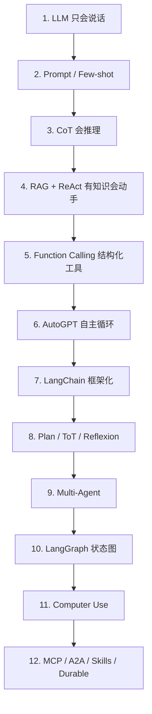

# Agent 发展历史：从「只会说话」到生产级数字员工

> 本文按「先有什么 → 卡在哪 → 谁提出什么 → 思路是什么 → 解决了什么 → 又暴露了什么」的因果链，梳理 **LLM Agent** 从 2020 前后到 2025–2026 的主流演进。
>
> 说明：更早的符号主义 Agent（BDI、Contract Net、Russell & Norvig 的 Agent 定义等）属于史前史，本文以影响当今工程实践的 **LLM Agent 主链路** 为主。

---

## 总览：12 段演进一览

| 段 | 时间大致 | 关键词 | 核心跃迁 |
|----|----------|--------|----------|
| 第 1 段 | 2020–2022 | LLM / Chat | 模型会说话，但不会行动 |
| 第 2 段 | 2020–2022 | Prompt / Few-shot | 不改权重也能适配任务 |
| 第 3 段 | 2022 | CoT | 会分步推理 |
| 第 4 段 | 2020 & 2022 | RAG + ReAct | 有外部知识 + 能动手（现代 Agent 心跳） |
| 第 5 段 | 2023 | Toolformer / Function Calling | 工具调用结构化、可校验 |
| 第 6 段 | 2023 | AutoGPT / BabyAGI | 自主长循环出圈，也暴露失控 |
| 第 7 段 | 2022–2024 | LangChain 等框架 | 模式产品化、可快速拼装 |
| 第 8 段 | 2023 | Plan / ToT / Reflexion | 规划、搜索、复盘 |
| 第 9 段 | 2023–2024 | Multi-Agent | 角色分工与协作 |
| 第 10 段 | 2024– | LangGraph / 状态图 | 生产级可控编排 |
| 第 11 段 | 2024–2025 | Computer Use | 从 API 到操作 GUI |
| 第 12 段 | 2025–2026 | MCP / A2A / Skills / Durable | 协议 + 技能 + 耐久执行（当前主流） |



---

## 第 1 段：只会「说话」的大模型（LLM / Chat）

### 先有什么

大规模预训练语言模型（GPT-3、后续的 InstructGPT / ChatGPT 等）把「下一个 token 预测」做到了可用的语言理解与生成水平。产品形态很快收敛为：**用户输入一段文本 → 模型输出一段文本**（补全或对话）。

这一阶段的核心能力是：

- 语言理解与生成
- 一定程度的世界知识（压缩在参数里）
- 指令跟随（尤其是对齐后的 Chat 模型）

### 卡在哪（问题）

1. **不能行动**：不会查实时股价、不能调公司内部 API、不能写文件跑命令。
2. **知识冻结**：训练截止后发生的事不知道；垂直领域私有数据也不在权重里。
3. **幻觉**：看起来很自信，事实可能是编的。
4. **多步任务脆弱**：复杂目标往往需要「查一查 → 算一算 → 再决策」，单轮生成扛不住。

### 这一阶段解决了什么

把「通用智能接口」做成了人人能用的产品：对话、写作、翻译、简单问答。Agent 还没成形，但 **「用自然语言驱动计算」** 的入口已经打开。

### 又暴露了什么

人们很快发现：只会说话的模型像一个「关在房间里的顾问」——有观点、没手、没最新资料。下一步自然是：怎样在不重新训练的情况下，把更多任务能力「挤」出来，以及怎样接外部世界。

---

## 第 2 段：提示工程 / Few-shot —— 把能力「挤」出来

### 先有什么

第 1 段的 LLM。同时，GPT-3 论文等证明了 **In-Context Learning**：在 Prompt 里给几个示例，模型就能模仿格式与任务逻辑，无需微调。

### 卡在哪

若每次都为新任务微调，成本高、周期长、部署重。业务侧需要「今天换个需求，改改 Prompt 就能跑」。

### 谁提出 / 什么技术

- **Zero-shot / Few-shot Prompting**（以 GPT-3 相关工作为代表，2020 前后成为主流实践）
- 工程上演化出 **Prompt Engineering**：角色设定、输出格式约束、思维引导、安全边界等

### 思路是什么

把任务说明书、示例、约束全部写进上下文窗口，把模型当成「可编程的文本引擎」：

- Zero-shot：只给指令
- Few-shot：指令 + 若干输入输出样例
- 后来还有角色扮演、输出 JSON schema 的软约束等

### 解决了什么

- **低成本适配**大量新任务
- 快速验证产品想法
- 为后续 CoT、ReAct 等「高级 Prompt 模式」奠定基础

### 又暴露了什么

1. **复杂推理仍弱**：数学应用题、多跳逻辑，一步蹦答案错误率高。
2. **稳定性差**：换个措辞结果就变；示例选不好会带偏。
3. **仍然没有手**：再精妙的 Prompt 也调不了工具、查不了私有库。
4. **上下文有限**：示例和说明书越写越长，挤占有效输入。

于是出现两条关键分支：**让模型「想明白」**（CoT），以及 **让模型「查得到」**（RAG，见第 4 段前半）。

---

## 第 3 段：Chain-of-Thought（CoT）—— 先想再答

### 先有什么

第 2 段的 Prompting：人们已经习惯用自然语言指挥模型，但复杂题仍常直接给错答案。

### 卡在哪

模型在内部可能有推理能力，但默认「压缩成一句结论」时容易跳步、算错、逻辑断裂。需要一种方式 **显式诱导中间推理过程**。

### 谁提出 / 什么技术

**2022 年初，Jason Wei 等人**发表 *Chain-of-Thought Prompting Elicits Reasoning in Large Language Models*。

相关衍生很快出现：

- Zero-shot CoT（「Let’s think step by step」）
- Self-Consistency（多样本推理再投票）
- 后来的 ToT 等（见第 8 段）可视为「推理结构」的进一步升级

### 思路是什么

不要逼模型一步出最终答案，而是让它先输出 **逐步推理轨迹（rationale）**，再给出结论。对足够大的模型，显式中间步骤能显著提升数学、常识推理、符号操纵等任务表现。

经典对比：

- 普通 Prompt：`问题 → 答案`
- CoT：`问题 → 步骤1 → 步骤2 → … → 答案`

### 解决了什么

- 推理类任务准确率大幅提升（论文中在 GSM8K 等基准上提升显著）
- 产生了 **可阅读、可诊断** 的推理轨迹（人能看出错在哪一步）
- 确立了「**推理是可被 Prompt 诱导的一等能力**」这一工程共识

### 又暴露了什么

1. **仍然封闭**：全程在参数知识和上下文里打转，拿不到实时网页、数据库、计算器真值（除非你把资料贴进 Prompt）。
2. **想多了也可能错**：中间步骤幻觉会传导到最终答案。
3. **成本上升**：多写很多 token。
4. **不会行动**：CoT 解决的是「想」，不是「做」。搜索、下单、改配置、调审核 API——一样做不了。

结论：CoT 把 Agent 大脑的「前额叶」点亮了，但还缺「手」和「感官」。

---

## 第 4 段：RAG + ReAct —— 有外部知识，并且能动手（现代 Agent 的心跳）

本段包含两条几乎平行、后来合流的主线：**外部知识（RAG）** 与 **外部行动（ReAct）**。

---

### 4.A RAG：先解决「不知道 / 记错」

#### 先有什么

LLM 参数知识有截止、有幻觉；企业法规、平台规则、私有文档不可能都塞进权重。

#### 卡在哪

纯靠 Prompt 贴全文：上下文爆、贵、不可扩展。需要「先检索相关片段，再基于片段生成」。

#### 谁提出 / 什么技术

**2020，Patrick Lewis 等人**提出 *Retrieval-Augmented Generation for Knowledge-Intensive NLP Tasks*（RAG）。

后续工程化演进包括：向量库、混合检索（BM25 + 向量）、重排（rerank）、Query 改写、以及更晚的 Agentic RAG / CRAG（见第 10–12 段）。

#### 思路是什么

把知识外置：

1. 文档切块、索引
2. 按问题检索 Top-K
3. 把检索结果塞进 Prompt，再生成答案

模型从「闭卷考试」变成「开卷考试」。

#### 解决了什么

- 缓解知识过时与垂直领域无知
- 可溯源（答案能指向文档片段）
- 知识更新不必重训模型，更新索引即可

#### 又暴露了什么

早期 RAG 多是 **线性流水线**：检索 → 生成。检索错了，生成再漂亮也错；「要不要检索、检索够不够、冲突怎么处理」缺少智能闭环。这为后来的 Adaptive RAG / CRAG / Agentic RAG 埋下伏笔。

---

### 4.B ReAct：现代 Agent 范式的诞生

#### 先有什么

CoT 会推理，但不会行动；另一些「只输出 Action」的 agent 设定又缺少可解释推理，容易乱点工具。

#### 卡在哪

需要一种范式，把 **推理（Reasoning）** 与 **行动（Acting）** 协同起来，并吃进环境反馈。

#### 谁提出 / 什么技术

**2022 年 10 月，Shunyu Yao（姚顺雨）等**（Google Research 等）发表 *ReAct: Synergizing Reasoning and Acting in Language Models*（ICLR 2023）。

#### 思路是什么

交错生成三类内容，形成闭环：

1. **Thought**：我现在该想什么、缺什么信息
2. **Action**：调用哪个工具、参数是什么（如 `Search["某法规"]`）
3. **Observation**：工具返回结果（环境反馈）
4. 再 Thought → … 直到 **Final Answer**

这就是至今仍被称作「Agent 心跳 / 内环」的结构。

#### 解决了什么

- 模型既能想又能做
- 轨迹可审计、可调试（人能看懂每一步为何调工具）
- 在问答、事实验证、文本游戏、网页购物等基准上验证有效
- **定义了后续几乎所有 Agent 框架的心智模型**（包括今天的 Coding Agent：读文件、跑测试、看日志，本质仍是 ReAct）

#### 又暴露了什么

1. **工具接口脆**：早期靠自由文本解析 Action，格式一歪就失败。
2. **何时停、何时继续** 靠模型自觉，易死循环或过早结束。
3. **目标漂移**：长任务中渐渐忘掉原始目标。
4. **成本与延迟**：多轮 Thought/Action 很贵。
5. **安全与权限**：一旦能调真实工具，误操作风险出现。

因此下一步必须让「动手」变成 **结构化、可校验的协议**，而不是自由发挥的字符串。

---

## 第 5 段：Toolformer / Function Calling —— 让「动手」变成协议

### 先有什么

ReAct 证明了 Thought–Action–Observation 可行，但工程上 Action 解析不稳定；每个应用自己发明工具调用格式。

### 卡在哪

需要模型 **稳定地决定「调不调、调哪个、参数是什么」**，并且运行时系统能机械执行、机械校验。

### 谁提出 / 什么技术

1. **2023 年 2 月，Timo Schick 等（Meta）**提出 *Toolformer: Language Models Can Teach Themselves to Use Tools*  
   - 思路：自监督方式让模型学习在文本中插入 API 调用，按是否降低困惑度等信号筛选。
2. **产业侧：OpenAI Function Calling / Tool Use**（以及随后各家 API 的 tools 协议）  
   - 用 JSON Schema 描述工具，模型输出结构化 `tool_calls`，运行时执行后把结果作为 tool message 回灌。

### 思路是什么

把「行动」从自然语言约定，升级为：

- **工具注册表**（name、description、parameters schema）
- **模型输出结构化调用**
- **运行时执行并返回 Observation**
- （可选）约束解码，进一步降低格式错误

Function Calling 在工程上可以视为：**ReAct 的 Action 通道 + Schema + 运行时**。

### 解决了什么

- 工具调用可靠性大幅提升
- 前后端/Agent 框架可以对齐同一套 tool 协议
- 为「Agent = LLM + Tools + Loop」的产品化扫清最大工程障碍

### 又暴露了什么

1. **有协议 ≠ 有产品**：循环谁来管？失败重试？状态存哪？人审怎么插？
2. **自主长任务仍失控**：模型拿着可靠工具，仍可能无意义地连调十几次。
3. **工具爆炸**：企业里工具一多，选型与权限成为新难题。
4. **演示型「全自动 Agent」**开始出现（见下一段），把「能调工具」误当成「能可靠交付」。

---

## 第 6 段：AutoGPT / BabyAGI —— 自主 Agent 爆发（也埋下生产雷）

### 先有什么

ReAct + 工具调用已经能做多步任务；ChatGPT 插件生态与开源工具链让「接搜索、接浏览器、接文件」变得容易。

### 卡在哪

实验室里的 Agent 多是单任务、短轨迹。人们想要：**给一个高层目标，Agent 自己拆任务、自己循环，直到完成**——接近「数字员工」想象。

### 谁提出 / 什么技术

**2023 年春季**，开源社区产品爆发：

- **AutoGPT**
- **BabyAGI**
- 以及 AgentGPT 等一众衍生

它们通常包含：目标管理、任务队列、记忆（向量库）、工具集、一个不断「创建子任务 → 执行 → 评估」的外环。

### 思路是什么

在 ReAct 内环外包一层 **自主规划外环**：

1. 理解用户目标
2. 生成/维护任务列表
3. 选下一个任务执行（再进 Thought–Action–Observation）
4. 根据结果更新任务列表与记忆
5. 直到自认为完成

### 解决了什么

- **概念验证**：LLM 确实能做跨工具、跨步骤的自主尝试
- 把「Agent」从论文词变成 GitHub 热词与创业叙事
- 倒逼业界认真对待记忆、规划、工具权限等问题

### 又暴露了什么（这一段的教训极关键）

1. **无界行为空间**：下一步几乎任意，难以静态分析与合规审计。
2. **死循环与烧钱**：重复搜索、重复尝试，token 账单失控。
3. **目标漂移与虚假完成**：宣布「完成」但结果不可用。
4. **不可复现**：同一目标多次运行路径完全不同。
5. **安全**：一旦接了真实写操作，误删改风险不可接受。

行业结论逐渐清晰：**Demo 型自治 ≠ 生产型 Agent**。必须补上工程约束：编排框架、状态机、预算、人审、可观测性。

---

## 第 7 段：编排框架（LangChain 等）—— 把模式产品化

### 先有什么

第 4–6 段已经出现 ReAct、RAG、工具、记忆、自治循环等「模式」，但每个团队从零拼 Prompt 与胶水代码。

### 卡在哪

缺少统一抽象：消息类型、工具接口、检索器、Agent 循环、观测追踪……重复造轮子，且难维护。

### 谁提出 / 什么技术

**2022 年 10 月前后，Harrison Chase 发起 LangChain**，并在 2023 Agent 浪潮中成为事实标准之一。

同期及稍后还有：

- LlamaIndex（偏 RAG/数据框架）
- 各云厂商的 Agent/Bot 框架
- 早期的 AgentExecutor（把 ReAct 循环封装成可运行组件）

### 思路是什么

把 LLM 应用拆成可组合积木：

- **Model I/O**：ChatModel、Prompt、OutputParser
- **Retrieval**：Loader、Splitter、VectorStore、Retriever
- **Tools**：统一 tool 抽象
- **Memory**：对话记忆
- **Agents**：AgentExecutor + 工具选择策略
- **Chains / LCEL**：把步骤串成可运行管道

开发者用「拼积木」代替「手写循环」。

### 解决了什么

- 大幅降低 RAG + Agent 的上手成本
- 生态集成（模型、向量库、搜索、观测）丰富
- 让团队能把精力放在业务 Prompt 与工具，而不是底层胶水

### 又暴露了什么

1. **线性 Chain 表达力不足**：真实业务有分支、短路、并行、回环（例如审核：黑名单命中直接出处罚，不必走完整 LLM 链）。
2. **AgentExecutor 偏黑盒**：循环内部不好改，复杂控制流最终仍落回大量自定义代码。
3. **「简历堆栈」风险**：会调 LangChain ≠ 会做可控 Agent；2024 后业界开始强调 Graph / 生产编排能力。
4. 仍然缺少一等公民的：**持久化 checkpoint、人机协同中断恢复、细粒度节点观测**。

于是出现两条加强线：一是 **更强的认知策略**（规划/搜索/反思，第 8 段），二是 **更强的运行时**（状态图，第 10 段）。

---

## 第 8 段：Plan / ToT / Reflexion —— 规划、搜索与复盘

### 先有什么

标准 ReAct 是「边想边走」的单线贪心策略：每一步局部最优，容易走进死胡同；失败后常常「换个说法再试」，没有真正沉淀教训。

### 卡在哪

1. 难问题需要 **先规划再执行**，或 **探索多条思维路径**。
2. 失败轨迹应变成 **可复用的经验**，而不是同一错误重蹈。

### 谁提出 / 什么技术

本段是一组互补技术，而非单一论文：

| 技术 | 代表工作 | 核心想法 |
|------|----------|----------|
| Plan-and-Execute / 先计划后执行 | 工业实践 + HuggingGPT 等 | 先出计划，再逐步执行，规划与执行角色可分离 |
| Tree of Thoughts (ToT) | **Yao 等，2023** | 把思维展开成树，可回溯、可评估中间状态 |
| Self-Refine | **Madaan 等，2023** | 对自身输出多轮批评与修订 |
| Reflexion | **Shinn 等，2023** | 失败后写自然语言反思，写入情景记忆，下轮带着教训再试（verbal RL） |

### 思路是什么

- **Plan**：把「怎么走」从执行环里提出来，减少边走边改的混乱。
- **ToT**：承认单线推理不够，引入搜索（BFS/DFS + 启发评估）。
- **Reflexion / Self-Refine**：把「评估–反馈–再生成」显式化；Reflexion 进一步把反馈存成跨尝试记忆。

### 解决了什么

- 提升难题与编程/推理基准上的成功率
- 提供「规划器 / 执行器 / 批评者」等可复用角色原型（为多智能体做铺垫）
- 让「记忆」不止是聊天记录，还可以是 **反思教训**

### 又暴露了什么

1. **规划也会错**；错误计划会浪费整条执行链。
2. **ToT 等搜索很贵**（分支一多 token 爆炸）。
3. **反思文本无结构**：可能空泛、自我洗脑，缺少硬校验。
4. 单 Agent 身兼规划/执行/评审，上下文打架；复杂组织任务需要 **多角色、多 Agent**（第 9 段）。
5. 这些仍是「认知策略」，不等于「生产运行时」——状态持久化、权限、短路、并行仍要靠编排层。

---

## 第 9 段：多智能体（Multi-Agent）—— 分工协作

### 先有什么

第 8 段已经出现规划者、执行者、批评者等「角色」，但多在同一 Agent 的 Prompt 里切换人格，能力与上下文容易互相污染。

### 卡在哪

复杂软件工程、研究调查、企业流程，需要 **专业化分工 + 互相审查**，单 Agent 上下文窗口与能力曲线不够用。

### 谁提出 / 什么技术

**2023–2024** 多智能体框架与项目密集出现，例如：

- **Microsoft AutoGen**（对话式多 Agent 编排）
- **MetaGPT**（用「软件公司」角色SOP 驱动协作）
- **CAMEL** 等角色扮演协作研究
- **CrewAI** 等更偏工程易用的多 Agent 编排

模式包括：主从（Supervisor）、流水线、群聊、辩论、评审委员会等。

### 思路是什么

把一个「全能 Agent」拆成多个「专业 Agent」：

- 每个 Agent 有自己的系统提示、工具子集、成功标准
- 通过消息传递或共享状态协作
- 用互审降低单点幻觉（例如写代码的 Agent + 跑测试的 Agent + 审查的 Agent）

### 解决了什么

- 复杂任务可分解、可并行（调研、编码、测试分工）
- 通过角色约束提升输出质量与规范性
- 更贴近真实组织分工，便于产品叙事与权限隔离（不同 Agent 不同工具权限）

### 又暴露了什么

1. **对话爆炸**：Agent 互相寒暄、重复讨论，成本倍增。
2. **权责不清**：谁说了算？何时结束？缺少明确拓扑时很难收敛。
3. **调试困难**：出错要在多段对话里溯源。
4. **为协作而协作**：很多任务其实单 Agent + 好工具就够，上多 Agent 是负优化。
5. 需要 **显式图拓扑 + 共享状态 + 收敛条件**，而不是无限群聊——这正是第 10 段状态图运行时要补的课。

---

## 第 10 段：LangGraph / 状态图 —— 生产编排的主流答案

### 先有什么

第 6 段的失控自治、第 7 段的线性 Chain、第 9 段的多 Agent 群聊，都指向同一缺口：**缺少一个一等公民的、带状态的、可控的执行运行时**。

### 卡在哪

生产系统要同时满足：

- 条件分支与短路（例如审核命中黑名单直接出罚则）
- 循环但必须有守卫（工具循环、反思循环不能无限）
- 并行与汇合（memory 与 RAG 同时跑再合并）
- 持久化与恢复（进程挂了能从 checkpoint 续跑）
- 人机协同（中断等待人工批准再继续）
- 可观测（每个节点耗时、token、输入输出可追）

这些用「巨型 Prompt + while True」或黑盒 AgentExecutor 很难优雅实现。

### 谁提出 / 什么技术

**LangGraph**（LangChain 团队，2024 起成为 Agent 编排主流选择之一）以及同类图/工作流运行时（各云 Agent 工作流、Prefect/Temporal 与 LLM 节点结合等）。

核心抽象：

- **State**：TypedDict / Pydantic 共享状态
- **Node**：读写状态的函数（LLM 调用、工具、规则代码）
- **Edge / Conditional Edge**：下一步怎么走
- **Checkpointer**：按 `thread_id` 持久化
- **Interrupt / HITL**：人审门闩

同时，知识侧演进到 **Agentic RAG / CRAG**：检索质量由评估/Agent 决定，差则重写查询或换源——「RAG 流水线」升级为「可分支的检索子图」。

### 思路是什么

一句话：**工程师定义路线图（图结构），LLM 在节点里当能力，而不是全程当不受约束的司机。**

对比：

| | 传统 DAG 工作流 | 纯 ReAct 自治 | 状态图 Agent（LangGraph 等） |
|--|-----------------|---------------|------------------------------|
| 路径 | 编译期固定、常无环 | 运行时几乎任意 | 边在编译期声明，可条件、可有环但可守卫 |
| 智能位置 | 节点多为脚本 | 全在模型 | 节点可脚本可模型 |
| 生产性 | 强可控、偏僵 | 灵活、易失控 | 灵活与可控折中 |

### 解决了什么

- 把 AutoGPT 式失控拉回可审计、可测、可限流的结构
- 表达真实业务图：分支、短路、并行 fan-in/fan-out、工具环
- checkpoint 支撑多轮会话与长任务恢复
- 与 LangSmith 等结合，按节点做追踪与评测
- 为合规场景（审核、证据、法条引用校验）提供「可上线」骨架

### 又暴露了什么

1. **图要人来设计**：SOP 不清时，图也会设计烂。
2. **工具/数据接入仍碎片化**：每个系统一套 adapter。
3. **Agent 间互操作缺标准**：跨团队、跨厂商 Agent 难协作。
4. **很多遗留系统没有 API**：只有 GUI——引出 Computer Use（第 11 段）。
5. **「连得上」之后，长期怎么稳定干活**（技能沉淀、权限治理、耐久执行）仍是开放问题（第 12 段）。

---

## 第 11 段：Computer Use —— 从 API 到「会用电脑」

### 先有什么

第 5–10 段默认工具是 **干净 API / MCP 工具 / 代码函数**。但大量真实工作发生在：网页后台、桌面软件、无 API 的内部系统。

### 卡在哪

RPA 传统方案脆（界面一改就挂）；纯 API Agent 覆盖不了长尾系统。需要 Agent **像人一样看屏幕、点鼠标、敲键盘**。

### 谁提出 / 什么技术

**2024–2025** 产业密集发布：

- Anthropic **Computer Use**
- OpenAI **Operator** 等浏览器/操作类 Agent
- 各类 Browser Agent（Playwright + 多模态感知）
- 编程 Agent 对本地 IDE/终端的深度控制（与 Computer Use 同源：操作环境而非只调 HTTP）

### 思路是什么

把「环境」从 JSON API 扩展为：

1. 截屏 / DOM / 辅助树等感知
2. 模型决定点击、输入、滚动等动作
3. 执行后再次感知，形成 ReAct 环

本质仍是 Thought–Action–Observation，只是 Action 空间变成了 GUI 原语。

### 解决了什么

- 覆盖无 API 遗留系统
- 打通「能在真实数字世界干活」的最后一公里
- 催生通用个人助理、运维助手、办公自动化新形态

### 又暴露了什么

1. **安全半径急剧放大**：误点「删除」「转账」「发送」后果严重。
2. **稳定性与成本**：视觉环更慢更贵，界面变化导致脆弱。
3. **权限与审计**成为硬需求：必须最小权限、确认门闩、操作回放。
4. 更需要 **协议标准化**（工具怎么暴露）和 **技能/SOP 封装**（怎么安全地重复办事）——进入第 12 段。

---

## 第 12 段：MCP / A2A / Skills / Durable —— 当前最主流、最先进的生产栈（2025–2026）

### 先有什么

到第 11 段，能力已经很强：会推理、会检索、会调工具、会编排、会协作、甚至会操作系统。但产业落地仍痛在三件事：

1. **连接碎片化**：每个框架、每个模型厂商一套 tool 插件。
2. **协作碎片化**：Agent 与 Agent 之间缺少标准委托协议。
3. **耐久与专业性不足**：长任务易中断；能力靠巨型 System Prompt 堆，难复用、难治理。

### 卡在哪

企业要的不是「更炫的 Demo」，而是：

- 工具一次封装、处处可用
- 跨团队 Agent 可发现、可委托、可鉴权
- 长任务可暂停、可恢复、可审计
- 领域 SOP 可沉淀为「技能包」，而不是每次从零 Prompt
- 内环仍然简单可控（ReAct），外环工程完备

### 谁提出 / 什么技术（当前主流拼图）

| 拼图 | 代表 | 解决的问题 |
|------|------|------------|
| **MCP**（Model Context Protocol） | Anthropic，2024.11 开源并快速成为业界事实标准 | Agent ↔ 工具/资源/提示的统一协议 |
| **A2A**（Agent-to-Agent） | Google 等推动的 Agent 互操作方向 | Agent ↔ Agent 的发现、委托、协作 |
| **Stateful Graph 编排** | LangGraph 等 | 控制流、状态、HITL、checkpoint |
| **Skills / 子 Agent** | 各厂商与开源实践（技能包、专业子代理） | 把 SOP、约束、工具顺序、验收标准封装复用 |
| **Durable Execution** | checkpoint + 工作流引擎（Temporal 等）思想与 LLM 编排结合 | 长任务失败恢复、等待外部事件、人工审批 |
| **Agentic RAG + 引用校验** | CRAG / 自适应检索 / citation verify | 知识任务可溯源、可纠错 |
| **治理与可观测** | LangSmith、权限、预算、策略引擎 | 成本、安全、合规、评测 |

### 思路是什么（分层，而不是单一银弹）

2026 前后业界共识是：**没有新魔法取代 ReAct，而是把系统分层。**

```
┌─────────────────────────────────────────┐
│  治理层：权限 / 预算 / 审计 / 评测 / HITL │
├─────────────────────────────────────────┤
│  协作层：A2A、多 Agent 拓扑、Supervisor   │
├─────────────────────────────────────────┤
│  连接层：MCP（工具·资源·提示）            │
├─────────────────────────────────────────┤
│  编排层：StateGraph（分支·循环守卫·并行·checkpoint）│
├─────────────────────────────────────────┤
│  能力层：LLM + Skills + Agentic RAG      │
├─────────────────────────────────────────┤
│  内环：Thought → Action → Observation    │
│        （ReAct + 结构化 Tool Call）       │
└─────────────────────────────────────────┘
```

要点：

- **内环**：仍是 2022 年 ReAct 的心跳；Function Calling / MCP 只是把 Action 通道标准化。
- **编排层**：决定「能不能上生产」——短路、并行、恢复、人审。
- **连接与协作层**：决定「能不能进企业生态」——工具与 Agent 可插拔。
- **Skills / Durable**：决定「能不能长期像员工一样办事」——专业、可恢复、可治理。

### 解决了什么

- 工具集成从「定制胶水」升级为「协议」
- 多 Agent 从「聊天群」升级为「可拓扑、可鉴权的协作」
- 长任务从「脚本跑通」升级为「可中断恢复的耐久执行」
- 领域能力从「堆 Prompt」升级为「可版本管理的技能资产」
- 整体从「Agent Demo」进入「Agent 基础设施 / 数字员工平台」阶段

### 仍暴露 / 正在演进的问题（下一波前沿）

1. **可靠性上限**：工具正确、图正确，模型仍会错；需要更强校验、形式化护栏、评测集。
2. **世界模型与长期记忆**：跨周、跨项目的稳定记忆与遗忘策略仍不成熟。
3. **成本与延迟**：多 Agent + 视觉 + 长上下文仍然贵。
4. **安全治理**：Computer Use + 持久权限 = 更大攻击面。
5. **评测标准**：静态 benchmark 难以代表真实业务 SOP。

这些构成 2026 之后的研究与工程前线，但 **不改变当前生产主流栈的分层图景**。

---

## 收束：用一条因果链记住全局

1. **会说话** → 不够 →  
2. **会 Prompt** → 复杂题不行 →  
3. **会 CoT 推理** → 没手没新知识 →  
4. **RAG 补知识 + ReAct 补行动** → 行动格式太脆 →  
5. **Function Calling 协议化** → 长自治失控 →  
6. **AutoGPT 证明上限也暴露失控** → 需要工程化 →  
7. **LangChain 等框架降低拼装成本** → 线性链不够 →  
8. **Plan / ToT / Reflexion 强化认知策略** → 单角色不够 →  
9. **Multi-Agent 分工** → 群聊易爆 →  
10. **LangGraph 状态图控住流程** → GUI 与生态仍痛 →  
11. **Computer Use 操作真实环境** → 连接与耐久成瓶颈 →  
12. **MCP / A2A / Skills / Durable 组成当前最主流生产栈**

**面试一句话版：**  
Agent 演进不是不断发明新缩写，而是给 LLM **持续补器官与补制度**：CoT 补推理，RAG 补知识，ReAct 补行动，Function Calling/MCP 补接口标准，Graph 补可控编排，Multi-Agent/A2A 补组织协作，Skills/Checkpoint/HITL 补生产耐久——**内环至今仍是 Thought–Action–Observation，变的是外环工程。**

---

## 附录：关键论文 / 节点速查

| 节点 | 代表 | 时间 |
|------|------|------|
| RAG | Lewis et al. | 2020 |
| CoT | Wei et al. | 2022 |
| ReAct | Yao et al. | 2022 |
| Toolformer | Schick et al. | 2023 |
| ToT | Yao et al. | 2023 |
| Reflexion | Shinn et al. | 2023 |
| Self-Refine | Madaan et al. | 2023 |
| LangChain | Harrison Chase | 2022– |
| AutoGPT / BabyAGI | 开源社区 | 2023 |
| AutoGen / MetaGPT / CrewAI | 各团队 | 2023–2024 |
| LangGraph | LangChain 团队 | 2024– |
| MCP | Anthropic | 2024.11 |
| Computer Use / Operator | Anthropic / OpenAI 等 | 2024–2025 |
| A2A / Skills / Durable Agents | 产业共识方向 | 2025–2026 |

---

*文档用途：知识拓展与面试复习。随产业快速演进，第 12 段细节会持续更新，但第 4 段 ReAct 作为内环范式的地位短期内不会被推翻。*
